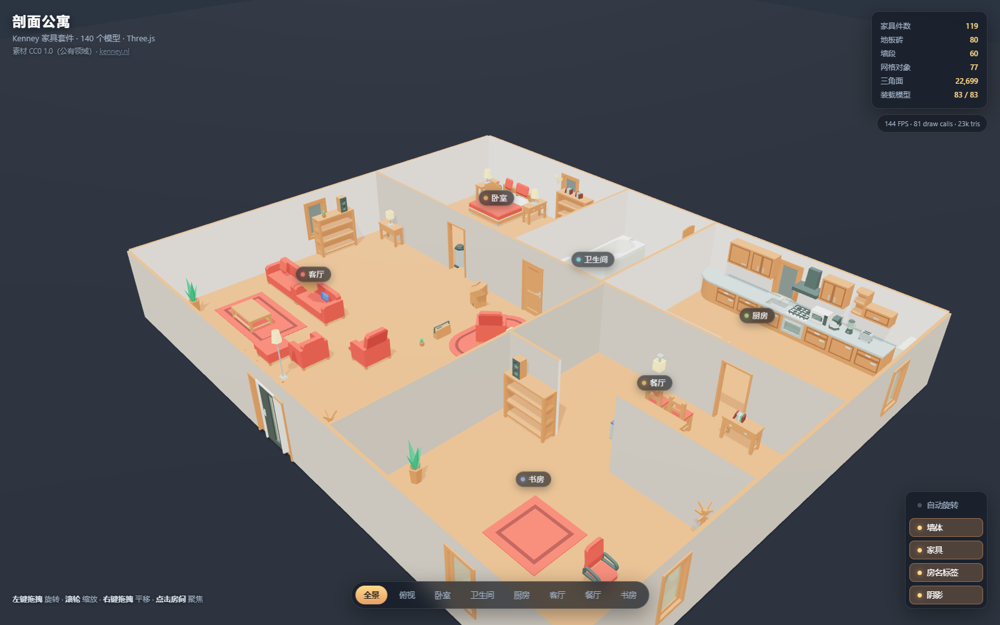

# 剖面公寓 · Kenney 家具套件 × Three.js

> **本文是场景与全部工具的完整说明** —— 六个房间、四类踩过的坑、全部读数、
> 可玩版本与参数化户型生成器。只想跑起来 / 想玩游戏，看仓库门面 [`README.md`](README.md)。

用 [Kenney Furniture Kit](https://kenney.nl/assets/furniture-kit)（CC0 公有领域，140 个模型）在浏览器里
搭的一套**剖面式公寓（cutaway dollhouse）**：六个房间、119 件家具，支持鼠标旋转 / 缩放 / 平移，
点房间可飞掠聚焦，右上角有实时统计数据。



---

## 快速开始

**Windows 上双击 `start.bat`** —— 它先找一个**真能跑**的 Python（`py -3` / `python` / `python3`，
并排除 Microsoft Store 那个只会弹商店的别名），起本地服务，**等服务端口真的应答之后**
才打开浏览器，而且默认直接开的是**游戏**（`play.html`）。

**要开哪一页，就双击哪个文件。** 页面关键字没法用双击传递，所以每一页配了一个双击入口：

| 想打开 | 双击 | 或者敲命令 |
| --- | --- | --- |
| 游戏 `play.html` | `start.bat` | `start.bat` · `python serve.py` |
| 户型工作台 `procgen.html` | `start-workbench.bat` | `start.bat workbench` · `python serve.py --workbench` |
| 场景查看器 `index.html` | `start-viewer.bat` | `start.bat viewer` · `python serve.py --viewer` |

> ⚠️ **不要双击 `procgen.html` / `play.html` / `index.html` 本身。** 浏览器禁止 `file://`
> 下的 ES 模块与 `fetch`，页面会渲染成一个「看着正常、其实一行代码都没跑」的空壳
> —— 参数面板是空的、状态永远停在「准备中…」。三个页面现在都会**自己**在屏幕上说清
> 这件事并给出正确命令（`js/open-guard.js`），但双击上面那三个 `.bat` 才是最短的路。


或者手动：

```bash
python serve.py                # 打开游戏 http://127.0.0.1:8777/play.html
python serve.py --viewer       # 打开场景查看器 http://127.0.0.1:8777/
python serve.py --workbench    # 打开户型工作台 http://127.0.0.1:8777/procgen.html
python serve.py 9000           # 换端口
python serve.py 9000 workbench # 端口和页面关键字可以混写
python serve.py --no-open      # 不自动开浏览器
```

> **为什么不能直接双击 `index.html`？**
> 浏览器禁止 `file://` 协议加载 ES 模块和 `.glb` 模型（CORS 限制），直接打开只会是一片空白。
> 项目里做了检测：真用 `file://` 打开时，页面会显示一段中文提示而不是白屏。

服务脚本会自己避让被占用的端口，并给 `.glb` 发正确的 `model/gltf-binary` MIME。

---

## 怎么玩

| 操作 | 效果 |
|---|---|
| 左键拖拽 | 环绕旋转 |
| 滚轮 | 缩放（1.2 m ~ 34 m） |
| 右键拖拽 | 平移 |
| 鼠标悬停房间 | 地面高亮描边 + 房间名气泡 |
| 点击房间 / 点房名标签 | 相机飞掠到该房间的预设机位 |
| 底部「全景 / 俯视 / 卧室…」 | 8 个预设机位 |
| 右侧开关 | 自动旋转、墙体显隐、家具显隐、房名标签、阴影 |

相机被限制在地平线以上（`maxPolarAngle = π/2 − 0.035`），所以不会掉到地板下面去看穿模型。

---

## 目录结构

```
An-Inch-of-Red/            = 仓库根 = 本目录
├── index.html            页面骨架 + importmap + file:// 兜底提示
├── play.html             ★ 可玩版本《一寸红》入口（自带 importmap / CSS，不动 index.html）
├── start.bat             Windows 双击启动 → 游戏（纯 ASCII + CRLF）
├── start-workbench.bat   双击 → 户型工作台 procgen.html
├── start-viewer.bat      双击 → 场景查看器 index.html
├── serve.py              本地静态服务（零依赖，仅 stdlib）
├── README.md             仓库门面（怎么跑 / 怎么玩）
├── SCENE.md              你正在看的这一页（完整说明）
├── CREDITS.md            素材授权与出处
├── GAME_DESIGN.md        玩法设计与其被实测推翻的假设
├── css/style.css         深板岩底 + 金/暖木强调色 + 毛玻璃面板
├── css/play.css          可玩版本的 HUD / 覆盖层（宣纸底 + 朱红 + 墨黑）
├── js/
│   ├── kit.js            ★ 模型装载 + 材质重建（项目的灵魂）
│   ├── layout.js         ★ 公寓即数据：墙、门、六个房间的全部家具坐标
│   ├── build.js          布局 → 场景图（合并为极少数 mesh）
│   ├── env.js            渲染器 / 渐变 IBL 环境 / 灯光 / 接影地面
│   ├── ui.js             进度条、HUD 统计、房名标签投影、拾取高亮
│   ├── app.js            引导：相机、OrbitControls、机位补间、导出的调试接口
│   └── open-guard.js     ★ 经典脚本：页面没跑起来时，由它说清「为什么」和「怎么打开」
├── game/                 ★ 玩法（见下面「可玩版本」一节）
│   ├── core/             ★ 纯逻辑核心：导航 / 视锥 / 藏点 / 守卫 / 模拟（零 three.js / DOM）
│   ├── arena/fromLayout.js  唯一知道「这是一间公寓」的适配器
│   ├── arenas/room_scene.json  场景快照（70 KB，换楼只换它；生成的要 107 KB）
│   ├── procgen/          ★ 参数化户型生成：floorplan / pipeline / draw / playground
│   ├── play/             渲染层：输入 → 意图、状态 → 画面、结束判定
│   ├── VERDICT.md        无头验证结论
│   └── NAME.md           ★ 命名决定书：《一寸红》/ An Inch of Red
├── assets/models/*.glb   从套件里收编的 140 个模型（1.87 MB，与原套件逐字节相同）
├── vendor/               Three.js r1xx（模块版 + OrbitControls / GLTFLoader / BufferGeometryUtils）
├── scripts/              自检 / 诊断 / 派生工具（索引见 scripts/README.md）
├── data/                 ★ 派生链的**输入**：140 模型的实测 bbox / 红面与玻璃面 / 墙体开口
├── work/                 临时产物（每次重跑都会重写）—— 不入库
├── reports/              验收报告留档（verify_play.log / verify_viewer.log / verify_name.txt …）
└── renders/              验收截图（`renders/` 查看器 8 张 · `renders/play/` 可玩版本 7 张）
```

---

## 六个房间

| 房间 | 家具 | 亮点 |
|---|---|---|
| 卧室 | 16 | 双人床靠北墙、两侧床头柜+台灯、北墙窗、东墙衣柜、床尾地毯、壁灯 |
| 卫生间 | 7 | 浴缸贴西墙、壁挂洗手盆 + 镜（高金属度）、吊柜 |
| 厨房 | 27 | 整条北墙橱柜带（转角柜/水槽/灶台/油烟机/吊柜）、东角冰箱、中岛 + 两个吧台凳 |
| 客厅 | 37 | 电视墙（电视柜/电视/双音响/开放书柜）、沙发组、茶几、阅读角、入户门与衣帽架 |
| 餐厅 | 13 | 圆地毯 + 十字餐桌 + 四把软垫椅 + 吊灯 + 餐边柜 |
| 书房 | 19 | 贴东墙书桌 + 显示器/键盘/鼠标、南墙双书柜、北侧矮书柜 |

---

## 实现里踩到的四个坑（都是实测出来的）

### 1. `KHR_materials_unlit` —— 全部 140 个模型都不吃光照

140/140 个模型都声明了 `KHR_materials_unlit`，GLTFLoader 于是返回 `MeshBasicMaterial`，
**完全不参与光照计算**。照搬原样渲染出来是一张平面海报，不是一个房间。
所以 `kit.js` 把每个材质都重建为 `MeshStandardMaterial`，并按 15 个语义色位给出各自的
粗糙度 / 金属度（`SURFACE` 表），灯罩额外带自发光。

### 2. 色彩空间 —— 素材是「sRGB 数值写在线性字段里」

glTF 规范说 `baseColorFactor` 是**线性**的。按线性读，沙发色 `(0.943, 0.367, 0.343)`
变成 `#F9A29D`，一种惨白的粉，整间公寓发灰；把同样的数字按 **sRGB** 读，它是 `#F05E57`,
和 Kenney 官方预览图里那抹鲜红完全一致。

判定依据：官方预览图是唯一的客观参照。修法是入材质时重新编码——
`new THREE.Color().setRGB(r, g, b, THREE.SRGBColorSpace)`。

**这一处对错，就是「海报」和「房间」的区别。**

### 3. 墙体是双面异色板，外表面是近黑色

按法线聚类做面积普查后发现：`wall` 的 `+Z` 面 1.290 m² 用 `_defaultMat`（室内白），
`-Z` 面 1.290 m² 用 `metalDark`（室外深墨青）。修正色彩空间之后，这层「外面」变成近黑，
绕着看过去整栋楼像个黑盒子。

`kit.js` 只对墙体构件（`WALL_MODELS`）的那个深色槽位重映射成暖白
`EXTERIOR_TINT = [0.90, 0.885, 0.86]`，不影响其它任何地方正当的深色点缀。

### 4. 这段套件画的是「剖面娃娃屋」，不是可堆叠的楼层

一层墙正好 1.290 m 高，`floorFull` 正好是 1.000 m 的网格，**没有天花板、不能堆叠**。
整个场景就是照这个语言搭的：四面留墙、顶面敞开、从斜上方看进去。

---

## 自检与验收

这些脚本不需要任何第三方依赖（Node 只用了内置的 `http` / `fetch` / `WebSocket`）。

```bash
# 全套验收：静态检查 → 无头渲染 → 断言 → 8 张截图 → 干净度
node scripts/shoot.js

# 只测一键启动脚本本身：起服务、抓 16 个资源、核对 MIME 与字节数
python scripts/smoke_serve.py

# 网络层取证：按 URL 聚合请求、区分「真失败」与「拿到 200 后被取消」
node scripts/probe_net.js

# 单个物件的近距离取证（SIDE=double 可强制双面材质做对照）
SIDE=front node scripts/probe_closeup.js

# 素材情报：GLB 解析 / 世界包围盒 / 图元归属
python scripts/probe_kit.py
python scripts/probe_world.py
python scripts/probe_prims.py
```

最近一次留档读数（`reports/verify_viewer.log`；重跑写到 `work/`，GPU = GTX 1660 SUPER）：

```
STATIC     files=6  failures=0
RIG        bedroom 0.983@y3.35  bath 0.985@y2.95  kitchen 0.992@y3.2
           living 0.999@y3.25  dining 0.925@y2.85  study 0.984@y3.05
SOLIDTOP   9 models, worst pct = 1
PROBE      furniture=119 floors=80 walls=60 doors=4 meshes=77 tris=22699 mats=18 files=83
CONTROLS   rotate=true zoom=true pan=true dist=1.2..34 drawCalls=81
SHOTS      ok=8/8  distinct sizes=8
CLEAN      exceptions=0 http>=400=0 netFailed=0 canceled-after-200=0 consoleErrors=0
VERDICT    PASS
```

`shoot.js` 里几条值得说明的断言：

- **`modelsLoaded === modelsRequested`** —— 布局点名的 83 个模型是否全部装载。这比
  「装载数 ≥ 40」强得多，也是下面那条「取消请求不算失败」得以成立的前提。
- **`canceled-after-200`** —— three.js 的 `FileLoader` 会把响应体包进自己的
  `ReadableStream` 做进度回传，Chromium 于是把**原始请求**记为 `net::ERR_ABORTED`
  并标 `canceled: true`，**哪怕每一字节都读完、模型也解析成功了**。这不是缺陷：
  每轮被取消的都是**不同的**文件（`kitchenBar` → `kitchenBlender` + 两个台灯 → `wallWindow`），
  而 `kit.entries` 始终是 83/83。所以它单独计数、单独打印，不计入判决；
  一旦真有模型没到，`modelsLoaded` 那条断言会立刻炸。
- **`RIG`** —— 每个房间的机位方向与设计朝向的余弦夹角，必须 > 0.5。这条断言正是
  「相机背对着该拍的墙」那个 bug 的守门人。
- **`SOLIDTOP`** —— 在每件家具脚印上打 25 条垂直射线，必须全部落在实体上。它守的是
  `mergePlaced()` 里那条静默路径：`mergeGeometries()` 遇到不匹配的输入会返回 `null`，
  然后 `if (!list) continue` 会**无声丢掉一整组材质**，不报任何错。

> 关于 `SOLIDTOP` 的边界：它查不出「光栅器剔除、但射线器接受」的面。
> 这两者对绕序的判定来自同一组顶点顺序，实际不存在这种分歧——
> 这也是为什么初版把客厅茶几当成「空心画框」是**一次误报**：25/25 全部命中桌面，
> 平视特写下顶板完整存在。真实原因是 48° 俯视把顶板压成极薄的掠射面，
> 它的亮木色与地板几乎同色，只剩深色框架边缘抢眼。

---

## 游戏化验证（可选，与查看器无关）

这个场景另有一套**纯逻辑、零依赖**的玩法核心与无头验证工具链，用来把玩法设计
从「意见」变成可数事实。它**不导入 three.js**，换一个场景快照即可复用。

```bash
node scripts/verify_game.mjs 24      # 74 s：可达性 + 藏点普查 + 预算×配置矩阵
node scripts/diag_oracle.mjs 12      # oracle/blind 到底差在哪（分支账目）
node scripts/diag_explore.mjs 60     # 探索策略对照（随机 vs 系统化）
```

- 设计文档：`GAME_DESIGN.md`（§3.8 是实测结论，原「近色博弈」假设已标注失效）
- **验证结论：`game/VERDICT.md`**
- 核心：`game/core/`（纯逻辑）· 适配器：`game/arena/fromLayout.js` · 快照：`game/arenas/room_scene.json`

---

## 可玩版本 ·《一寸红》/ An Inch of Red

> **你是一只 42 cm 高的小东西。红包永远不在低处 —— 而守卫的光永远在地上。**
>
> 命名由来、落选方案、改名清单见 `game/NAME.md`。
> 「寻红」是内部代号，继续留在源码、日志与验证报告里 —— 在那里它是测量记录的一部分。

`play.html` 是这套场景上的第一人称游戏：**限时找齐 6 个红包**，同时避开巡逻的守卫。
和查看器**同一个服务**，所以还是那一条命令：

```bash
python serve.py        # 然后打开 http://127.0.0.1:8777/play.html
```

| 操作 | 效果 |
|---|---|
| `W` `A` `S` `D` | 前后左右（贴墙会滑行，不会卡住） |
| **鼠标** | **唯一的转向方式**（点画面锁定指针）。Q/E 与 ←→ 已取消 |
| `空格` | 跳跃。峰值 **0.441 m**、滞空约 0.77 s
  （眼高 0.36 + 峰 0.441 = **0.78 m**，仍低于 1.29 m 的墙 —— 跳起来也看不进隔壁） |
| `空格` + `W` | **跳上家具。** 空中带前冲，落地就**站在家具顶上**：茶几 0.23、浴缸 0.42、
  沙发 0.46、书桌 0.38、厨房台面 0.45、床 0.375 都上得去；0.92 的冰箱**上不去** |
| `G` | 红点提示开关（关掉就是硬核模式） |
| `M` | 静音　`Esc` / `P`：暂停 |
| 左上角缩略图 | 260 × 211 px 平面图 + **12 px** 房名 + **你的朝向** + **守卫的朝向**
  （按模式变色）。刻意不画红包、也不画未裁剪的视锥 |

**每局重新藏红包，但种子照旧可复现。** 摆放不再是「每日一种子」，而是每局随机
（`crypto.getRandomValues` + 日期前缀）；种子的**字符本身**仍然写进开始页与结束页——
同一串种子可以逐位重建同一局。开始页的种子框填一串即把布局钉死，**留空 = 随机**
（`verify_play.mjs` 对这条有断言：同种子两次摆放逐位相同，空种子两次摆放不同）。

**地上那片光，就是守卫的监控区。** 守卫身上挂一盏 `SpotLight`，它的角度与射程和
它脚下那个扇形**取自同一个 `cfg`**（`coneDeg` / `range`），所以「它能看见多大一块地」
和「地上亮了多大一块」不可能各说各话。两者的分工是刻意的：扇形的**形状**由核心
逐射线裁剪后的贴花给出，灯的职责是让那块地被**照亮**——各自只做自己擅长的事，
才不会互相撒谎。难度越高，扇区越大、光斑越大；同一张表里红包同时变小。

**红包不在任何房间的地上。** 摆放在空中层：桌面、台面、柜顶；或者**塞进柜子里**
（冰箱 / 微波炉玻璃后，`y = 0.12` 是柜子的地板，不是房间的地板）；
或者**夹在两件东西中间**（16 条射线里四分之一被挡，且邻居更高）。
**也不是每个房间都必有**——这一局卧室就是空的（`verify_play` 对此有断言）。

⇒ 由此长出一条**新的玩法轴**：这个小人的眼高只有 **0.36 m**，而厨房台面 0.45 m，
**站在地上看不见台面上有什么**——这不是美术问题，是几何：从 0.36 m 的眼睛到
0.45 m 的东西，视线必然被台面自己的近边挡掉。所以「找」的后半段是**爬上去看**。
这条不是润色：同一个走法、同一个预算、同一批种子，**不许它爬上家具**
在 180 s 里只找得到 **0.83/6** 个红包，**允许**是 **5.67/6**
（`game/VERDICT.md` §6.2 对照 A）。能站上去的面共 **67 个立点 / 16 类**，
最高的可站面是 0.63 m 的躺椅；`climbCeilOf` 把视线锁在墙高以下，
所以站在任何家具上都看不进隔壁房间。

| 难度 | 预算 | 监控区（扇区 = 投光） | 红包 | 24 种子 × **玩家型人格**，按本卡自己的预算（VERDICT §6.2） |
|---|---|---|---|---|
| 见习 `solo` | 240 s | 无守卫 | 18.4 × 11.5 cm | **66.7 %** · 收 5.67/6 |
| **标准 `patrol`** | 180 s | 74° × 4.2 m（**11.4 m²**） | 16.0 × 10.0 cm | **33.3 %** · 收 4.83/6 |
| 紧张 `tight` | 180 s | 88° × 5.0 m（**19.2 m²**） | 13.6 × 8.5 cm | **29.2 %** · 收 4.88/6 |
| 硬核 `hunter` | 180 s | 96° × 6.0 m（**30.2 m²**） | 11.2 × 7.0 cm | **12.5 %** · 收 3.54/6 |

红包尺寸**不是装饰**：察觉距离 `noticeRange()` 是由红包自身的面积算出来的，
所以把红包缩小，会连同「AI 与玩家在多远处能发现它」一起缩小。
⇒ **动过旋钮的难度必须重新量胜率**，不能引用固定布局时期的老数字，那组数字
描述的是另一个世界。

**这张表和上一版整张都不一样，原因值得写在表旁边。** 上一版
（50.0 / 33.3 / 12.5 / 4.2 %）取自在 2.1 m/s、墙不挡视线、**红包摊在地上**的
世界里跑的人格。这一版的世界换了三件事（速度 1.5、视锥被墙切开、红包离地），
量它的人格也换了一次：旧人格巡的是 **269 个 0.5 m 栅格立点**、每次扫视 2.2 s，
**把全屋看一遍要 592 s**，于是它 180 s 的读数描述的是「这条路线停在哪儿」，
不是关卡。换成「每房转一次 + 每个可爬模型一个立点」的 **20 点玩家型人格**
（`place.js` `playerViewpoints()`）之后，四个档位才第一次出现可区分的高下。
过程、两个对照、以及那条最要紧的 **0.83/6 → 5.67/6**，都在 `game/VERDICT.md` §6.2。

表里的扇区面积是按圆扇形 `½θr²` 算的**几何量**，不是游戏测出来的，卡片上也是这么标的。
（AI 的数字是**下界**：它是最近邻巡 20 个立点的机器，不会因为听见脚步改道，
也不会记住「这间房我翻过了」。）

**渲染层不做任何玩法判断。** 碰撞、视锥、红包位置、巡逻路线全部来自 `game/core/`
——也就是 `game/VERDICT.md` 里那套无头矩阵跑过的**同一个世界**。这不是声明，是断言：
`scripts/verify_play.mjs` 在 Node 侧用另一份独立写出的参数重算一遍摆放，再和浏览器
逐坐标比对（漂移 1e-6 以内）。

```bash
node scripts/verify_play.mjs      # 70 条：同世界 / 碰撞不变量 / 拾取 / 守卫 / 跳跃契约 /
                                  #       跳上家具 / 红包要爬上去取 / 红包不在任何地上 /
                                  #       鼠标是唯一转向 / 每局随机且种子可复现 /
                                  #       缩略图字号 / 难度双旋钮 / 光的 A/B 像素差 /
                                  #       开始页确实在屏幕上 / 像素统计
node scripts/measure_surveil.mjs  # 难度阶梯的胜率重测：24 种子 × 4 配置 × 预算 120/180/240
node scripts/diag_ai_sight.mjs    # 每个红包能从哪些视角被看见（地板 vs 登高），按档位分
node scripts/diag_coverage.mjs    # 看全 6 个红包要几次扫视：4 套立点集的贪心集合覆盖
node scripts/diag_guard.mjs       # 守卫 600 s 班次：有没有站在实体里、有没有走出平面
node scripts/diag_guard_where.mjs # 那 600 s 花在哪：走 / 扫视 / 卡住
node scripts/probe_guard_sight.mjs # 用核心自己的 Guard.look() 回答「它到底看没看见你」
node scripts/probe_guard_render.mjs # 守卫可见/隐藏两帧逐像素 diff：它到底有没有被画进画面
node scripts/probe_guard_light.mjs  # 那盏监控灯有没有真的照到地上（并证伪了一次没用的强度扫描）
node scripts/probe_grab_recipe.mjs  # 同一个 A/B 换 6 种取像素配方：到底是哪一步瞎了
```

最近一次留档读数（`reports/verify_play.log`；重跑写到 `work/verify_play.log`，GPU = GTX 1660 SUPER）：**70/70 PASS**，
浏览器内守卫 60 s 走 **42.69 m**、进入 **3 个房间**（dining / living / study），被抓住罚时 15 s
（**旧读数「覆盖全部 6 个房间」已作废**：它是在守卫还能穿过外墙时量的，属于「穿墙的覆盖率不是覆盖率」。
补上碰撞后，守卫的 0.15 m 导航半径让卧室 / 卫生间 / 厨房各自成为独立连通块 —— 它根本进不去。
量这件事的是 `scripts/diag_guard_reach.mjs`，它现在直接打 VERDICT）；
跳跃：峰值 **0.422 m**（解析值 `v²/2g` = 0.441 m，1/60 s 的步进吃掉 4.3 %）、
落地后水平位移 **0.0 m**、滞空 43 帧全程 `nav.clear` 为真；
鼠标：120 px → **−0.2520 rad**，而几何判据（前向 · 右向量）给出 +240 px → **+0.4829**、
−480 px → **−0.4829**：指针往屏幕哪边移，人就往哪边转；
缩略图：**44453 px** 平面（6 房间 6 门），12 px 字号下 **6/6** 房间仍挂得住标签，
你/守卫的箭头质心距各自 `project()` **1.07 / 1.13 px**；
难度双旋钮：扇区 **0 → 11.4 → 19.2 → 30.2 m²** 单调增、红包
**18.4×11.5 → 11.2×7.0 cm** 单调减，屏幕上那个红包与 census 门控用的尺寸误差 **0.0000 m**；
监控灯：与扇形共用同一组 `angle` / `distance`（96.0° × 6.0 m @ i 5.00）、指向误差
**1.00000**（1.000 = 正前方），把灯关掉再渲染一帧，**3988/96000 px**
（4.2 % 画面、最大通道差 61）随灯而变 —— 它确实照亮了它声称的那块地。
跳上家具：浴缸 **0.420** / 书桌 **0.384** / 厨房抽屉 **0.450** 三个面都跳上去站住了
（`groundY` 与台面顶逐位相等），0.92 的冰箱**一次跳不上去**；
站上去之后眼睛 **0.810 m**，仍低于 1.29 m 的墙。
红包：**6/6 都不在房间地板上**，6/6 都够得着（各有一个立点），其中 3 个必须爬；
每个空中红包都带着它起跳用的那一格地板（`pad`）。

---

## 参数化生成户型 · `scripts/procgen.mjs`

**按参数造一栋楼，再用同一套管线验它能不能玩。**

```bash
node scripts/procgen.mjs --sweep      # 12 组参数：现在 12/12 PASS
node scripts/procgen.mjs --w 16 --d 14 --rooms 10 --items 160 --seed genA \
     --out-layout js/layout.gen.js --arena game/arenas/gen.json
```

「验收」不是看它好不好看。每一套生成结果都走**与上架公寓完全相同**的那条管线，
判决是一串可数事实：结构校验 / 每个开口都有门 / 玩家导航**只有一个连通块** /
每个房间都能被解析且互不共用 / 从出生点 A* 能到每个房间 / 6 个红包全部放得下 /
**快照自带这一层的 `layout`**（第 9 项，见下）。

### 把生成出来的户型真的走一遍

```bash
node scripts/verify_gen_play.mjs --w 16 --d 14 --rooms 10 --items 160 --seed genA
```

**20 条**断言，其中三条是上架验收做不到的：

1. **确认玩的就是生成的那一层。** `play.html` 在没有 `?arena=` 时会退回上架公寓，
   于是一个**静默退回**的页面会顺利启动、正常渲染、放好 6 个红包、报出健康的导航 ——
   一张全绿的板子描述着**另一层楼**。所以除了逐坐标对账，还**断言这一层的导航格数与上架公寓不同**。
2. **要求每个房间都有一个守卫真能走到的巡逻点。** `waypoints > 0` 只能说明守卫醒着；
   `waypoints >= 房间数` 才能说明全屋都被巡逻到。这条正是「守卫只巡逻 1 个房间」的捕手。
3. **不把机位交给被测对象自己的状态。** 早先的写法是在玩家所在处取一帧，
   而那一帧可以合法地是 30 cm 外的一面墙 —— 于是一条**正确的**渲染被读成「画面没亮」。
   现在强断言取自**墙顶之上**（没有东西挡得住它），第一人称那条取**整轮扫视里最好的一帧**。

生成出来的楼层直接可玩：`play.html?arena=./game/arenas/gen.json`

| 参数 | 结果 |
|---|---|
| `--w 16 --d 14 --rooms 10 --items 160 --seed genA` | **20/20 PASS**；10 房、家具 153/160；导航 68667 格**单连通**；守卫 23 个航点 **0 掉点** |
| `--w 12 --d 9 --rooms 7 --items 90 --seed genB` | **20/20 PASS**；7 房；守卫 14 个航点 **0 掉点** |

两层楼上，Node 与浏览器放出的 6 个红包**逐坐标相同（漂移 0.0e+0 m）**。
截图落在 `renders/gen/`。

### 世界一致性：看到的房子 == 玩的房子

**这条断言曾经不存在，代价是一整层楼。**

生成器验过了结构、导航、房间、红包、巡逻、边界 —— 全绿。玩家走进去看到的却是
**上架公寓**：`play.js` 在模块顶层从 `js/layout.js` 盖房子，它根本不知道有「竞技场」
这回事。于是一层 16×14 m 的十房楼被画成 10×8 m 的六房公寓，出生点落在楼外正对着
外墙，红包悬在半空（`scripts/diag_world.mjs` 实测：plan 16x14 / 10 房，
world 10.14x8.15 / 6 房）。

修法不是「让 play 也读一下 `js/layout.js`」—— 那只是留下**两份真相**等着再次漂移。
真正缺的是：**楼层快照自己说不清要盖什么**。所以现在每个 `Level` 都自带一份它被建出来
的 `layout`（`game/arena/fromLayout.js`），`play.html` 从它派生要下载的模型、地面尺寸、
阴影相机和全部几何；没有 `layout` 的快照**直接抛错**并点名，不退回上架公寓 ——
静默退回正是要防的那件事。

```bash
node scripts/verify_world.mjs      # 三栋楼三个尺寸，逐栋对账世界与楼层
```

**25 条**，三栋楼的平面互不相同（10×8 六房 / 16×14 十房 / 9×9 五房），
所以一个手工调过的文件没法让它蒙混过关：

| 判什么 | 怎么判 |
|---|---|
| 世界和平面一样宽 | 包围盒 == 平面 + 墙厚（实测 +0.14 / +0.15 m） |
| 画出来的房间就是楼层的房间 | 按 **id 逐个点名**（`bedroom2` / `dining2` 这种名字只有生成楼层有） |
| 地砖 / 门 / 家具是三组 1:1 | `80/80`、`5/5`、`119/119` 这种严格相等，不是「看着挺满」 |
| **你站在楼板上** | 从出生点垂直向下打一条射线，命中的必须是这栋楼自己的地板，而不是旁边的裸地 |
| 没有 `layout` 的快照**响亮地拒绝** | 负向对照：页面必须停在启动失败页并点名 `layout`，而不是照常启动 |

那栋诱饵就是同一层 9×9 楼**砍掉一个字段**：其余每一条断言都会在它上面通过。

### 命令行全量参数

除四个主参数外，生成器自己的旋钮也接到了命令行上（不带 `--` 前缀的定义在
`game/procgen/floorplan.js` 的 `DEFAULTS` 里）：

| 参数 | 默认 | 含义 |
|---|---|---|
| `--w` / `--d` | 10 / 8 | 户型整体尺寸（米） |
| `--rooms` | 6 | 房间数。尺寸装不下的数量**当场报 FAIL**，不会静默少给 |
| `--items` | 60 | 家具件数（单房间另有 `--roomCap` 硬上限） |
| `--seed` | `procgen` | 种子。同参数 + 同种子 → 逐位相同 |
| `--minRoom` | 2.4 | 房间最短边（米），一次拆分的两侧都要满足 |
| `--lane` | 0.62 | 每个门口前预留的净通道（米） |
| `--gap` | 0.02 | 两件家具包围盒之间的间隙（米） |
| `--doorMargin` | 1 | 门离房间角落的最小距离（格），尽量满足 |
| `--loopDoor` | 0.28 | 在生成树之外多开一个门的概率 |
| `--maxLoopDoors` | 2 | 额外门的数量上限 |
| `--windowChance` | 0.20 | 一面墙成为窗的概率 |
| `--roomCap` | 26 | 单个房间的家具数硬上限 |
| `--floorTries` | 26 | 独立家具的拒绝采样预算 |

批量与输出：

| 参数 | 含义 |
|---|---|
| `--sweep` | 跑固定 12 组参数网格（即上表 12/12 那一轮） |
| `--count N` | 同参数下跑 N 个种子，种子名为 `<seed>-1` … `<seed>-N` |
| `--out-layout P` | 把**第 1 组**结果写成 `js/layout.<x>.js`（与 `js/layout.js` 同 schema）。**游戏不读这个模块** —— 快照自带一份 `layout`，这里写出来只为读源码 / diff / 复审 |
| `--arena P` | 写成 `game/arenas/*.json` 快照，供 `play.html?arena=` 读取。快照里**自带这一层的 `layout`**：几何随档案走，不靠路径，所以「看到的房子」不可能是「别的房子」 |
| `--json P` | 逐组导出机器可读的断言与红包坐标 |
| `--svg P` / `--scale N` | 平面图的落盘路径与绘图比例。不给 `--svg` 时**跟随 `--report`**（同名的 `.svg`），再缺省才是 `reports/procgen.svg` |
| `--report P` | 断言日志的落盘路径（默认 `reports/procgen.txt`）。**入库的证据就是这个文件**，所以任何替自己跑生成器的脚本都得重定向它 —— 五套验收脚本现在都指向 `work/`。**平面图跟着它走**：不给 `--svg` 时，图写到 `P` 同名的 `.svg` |
| `--quiet` | 完全静默（连 12/12 那句总结也不打；**但产物照写**，包括 `reports/procgen.txt`） |

退出码可直接接 CI：全组 PASS 为 `0`，任一组 FAIL 为 `2`，参数或素材缺失为 `3`。

### 在浏览器里调参：`procgen.html`

不想敲命令就用工作台：左边调参数（尺寸 / 房间数 / 物品数 / 种子，外加 9 个高级旋钮），
右边立刻画出平面图并列出 9 项断言。

```bash
start.bat workbench           # 起本地服务并直接打开工作台
start-workbench.bat           # 同一件事，双击即可（关键字没法双击传递）
start.bat                     # 只起服务（默认开游戏 play.html）
# 或手动敲链接：http://127.0.0.1:<端口>/procgen.html
node scripts/verify_world.mjs        # 世界一致性：看到的房子 == 玩的房子（世界侧唯一判决）
node scripts/verify_playground.mjs   # 工作台自己的 34 条验收（自起服务，CI 用）
node scripts/verify_live.mjs         # 对「已经在跑」的服务做同一套对账，--url 指哪测哪
node scripts/verify_open.mjs         # 打开方式验收：三个页面在 file:// 下必须明说，在 http:// 下必须正常
node scripts/diag_open.mjs           # 诊断「页面是空壳」：同一个文件两种打开方式逐项对账
```

> 端口默认 8777。`start.bat` 的参数会原样交给 `serve.py`，所以
> `start.bat workbench` / `start.bat viewer` / `start.bat 9000 workbench`
> 都能用 —— 页面关键字和端口可以混写。

页面**不是**第二份实现：它调用 `game/procgen/pipeline.js` 与 `game/procgen/draw.js`，
也就是命令行调用的那两个模块。实测同一个参数下，页面里生成的场景快照与
`procgen.mjs --arena` 写出的文件**逐字节相同**（68959 字符，`identical`）。

按「走进去玩」会把**你正在看的那一层**直接交给游戏（经 `sessionStorage`）：
不需要先导出文件，也不存在「预览一层、玩到另一层」。

平面图上画的红包，就是进去后游戏会放的那六个 —— 这句话曾经**不成立**。
验证器用的是 `prizes-<seed>` 这条随机流，游戏用的是 `<seed>` 那条；两边单看都像是
有意为之，合起来的后果却是**预览标着游戏永远不会用的位置**。实测 17 组参数里
**16 组不一致**，最远一颗差 **8.85 m**（差出一整间房）。

修法不是「改掉其中一个标签」—— 那会留下两份拷贝，等着再次漂移。两条流现在合并成
`game/core/place.js` 里的一个 `prizeRng(seed)`，游戏与验证器都从那里取。游戏侧的
红包坐标**逐位未变**（2 张场景 × 5 个种子 = 10/10 组完全一致），而预览与游戏的对账
从「17 组里 16 组不一致」变成 **0.0e+0 m**。

> ⚠️ 不带 `--report` 手动跑 `procgen.mjs` 仍会重写 `reports/procgen.txt` /
> `reports/procgen.svg`，而这两个文件是**入库的证据**（README 头条那句 12/12 指的就是它）。
> 五套验收脚本已经改用 `--report` 把日志写进 `work/`，平面图**跟着 `--report` 走**，
> 所以「最后必须跑 sweep」这条规矩已经取消：谁先谁后都不再动那份证据。
> 你自己做试验时也请带上 `--report work/scratch.txt`。
>
> 这条规矩**曾经只落实了一半**：`--report` 改写了日志，图仍然落在 `reports/` ——
> 于是 `verify_playground.mjs` 的**第二组参数**（只带了 `--report`）每跑一次，
> 就把 323000 B 的 12 宫格证据盖成一张 31927 B 的单图。量出来的差别是
> **12 张平面 → 1 张**（每张一条的 ` rooms · ` 标签 12 次 → 1 次；`<g>` 24 → 1）；
> 别去数 `<svg>` 根 —— 宫格图也是**一个**根里装 12 张，数它会报「毫无变化」。
> 现在 `--report` 连图一起带走，而 `verify_playground.mjs` 自己也会在跑完之后
> **复查那两个文件的哈希没变** —— 这条断言以前不存在，所以「证据没被动过」
> 当时只是我的一句话，不是一次测量。

---

## 素材授权

Kenney Furniture Kit，**CC0 1.0 公有领域**，可自由用于商业项目，无需署名。
来源：<https://kenney.nl/assets/furniture-kit>
